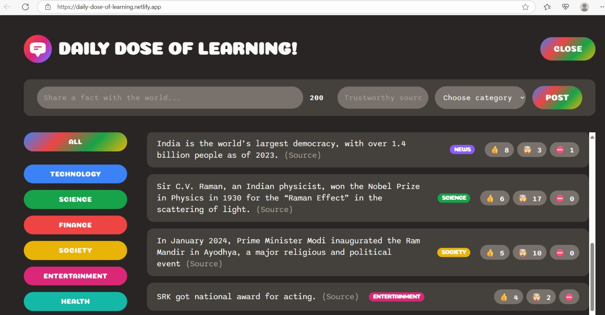
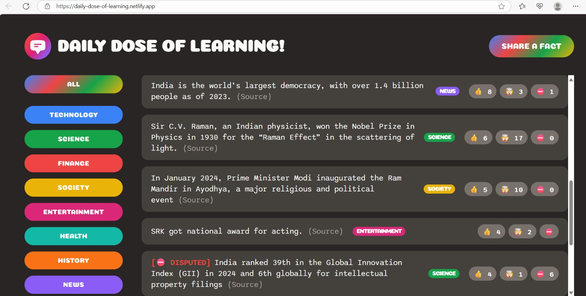
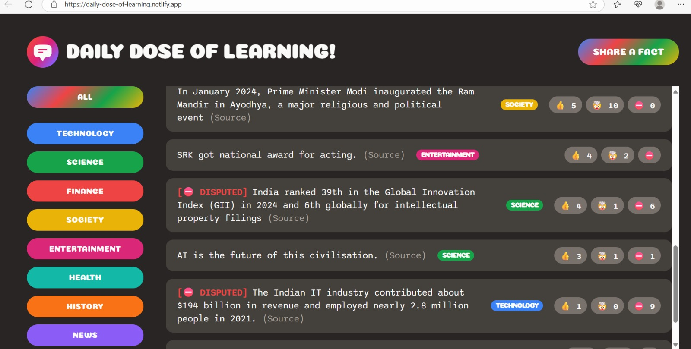

# Daily Dose of Learning

A platform where anyone can share what they have learned today as a fact with a reliable source link, categorized by topics such as science, technology, entertainment, news, society, finance, etc.

---

## Table of Contents

- [Features](#features)
- [Demo & Images](#demo--images)
- [Tech Stack](#tech-stack)
- [Getting Started](#getting-started)
- [Live Demo](#live-demo)

---

## Features

- Click **Share a fact** to submit your daily learning with a trustworthy source.
- Select one category for your fact.
- Browse facts posted by others.
- Upvote facts by clicking 👍 if you find them helpful.
- Downvote facts by clicking ⛔️ if you think they are false.
- Facts with more downvotes than upvotes will show a **[DISPUTED]** label and appear at the bottom.
- Filter facts on the sidebar by categories like science, technology, finance, etc., to see facts relevant to your interest.
- Responsive, modern React interface with real-time Supabase backend.

---

## Demo & Images

  
*Fact submission form with validation*

  
*Facts feed with category filters*

  
*Voting on facts and disputed fact highlighting*

---

## Tech Stack

- Frontend: React, JavaScript, HTML, CSS
- Backend & Database: Supabase 
- Hosting: Netlify

---

## Getting Started

Follow these steps to get a copy of the project running locally:

### Prerequisites

- Node.js (version 14 or higher recommended)
- npm (comes with Node.js)
- Git

### Installation

1. Clone the repository:
   ```
   git clone https://github.com/Manish614/daily-dose-of-learning.git
   cd daily-dose-of-learning
   ```

2. Install dependencies:
   ```
   npm install
   ```

3. Create a `.env` file in the root directory and add your Supabase environment variables:
   ```
   REACT_APP_SUPABASE_URL = your_supabase_url
   REACT_APP_SUPABASE_KEY = your_supabase_anon_public_key
   PROJECT_URL = your_project_url
   API_KEY = your_api_key
   AUTHORIZATION = Bearer your_api_key 
   ```
   > **Important:** Use your Supabase **anon** (public) key here, not the service role key.

4. Start the development server:
   ```
   npm start
   ```

5. Open your browser to [http://localhost:3000](http://localhost:3000) to view the app locally.

---


## Live Demo

[https://daily-dose-of-learning.netlify.app/](https://daily-dose-of-learning.netlify.app/)
